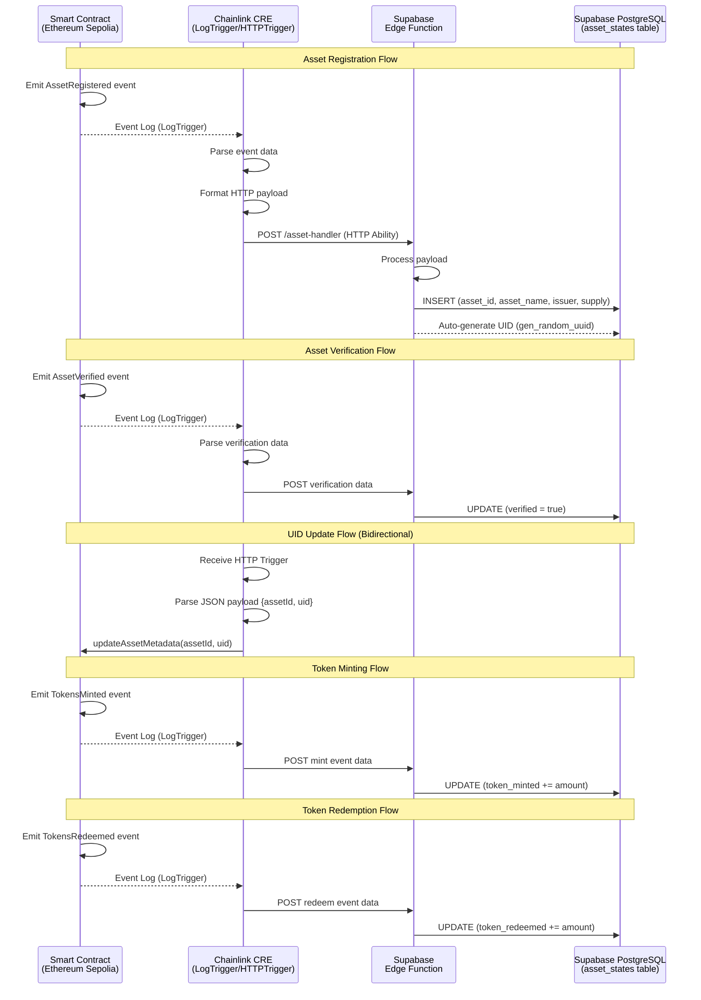

# Chainlink CRE LogTrigger and HTTP Ability Showcase

This repository demonstrates the integration of Chainlink Runtime Environment (CRE) with LogTrigger and HTTP abilities to enable seamless off-chain data orchestration for tokenized assets. The project tokenizes various real-world assets (RWAs) using Ethereum Solidity smart contracts and leverages Chainlink CRE and Supabase (Edge Functions + PostgreSQL) to track the full lifecycle of these tokenized assets.

## Content
- [Project Overview](#project-overview)
  - [Tokenization and Lifecycle Management](#tokenization-and-lifecycle-management)
- [Flow Diagram](#flow-diagram)
- [Getting Started](#getting-started)
  - [Prerequisites](#prerequisites)
  - [Usage Steps](#usage-steps)
- [Troubleshooting](#troubleshooting)

## Project Overview
### Tokenization and Lifecycle Management
The core of this project is an Ethereum-based Solidity smart contract that facilitates the tokenization of diverse asset classes, including invoices, Treasury bills (T-bills), loans, and carbon credits. Users interact with the contract via specialized functions to manage asset operations, such as:

- Register: Onboard a new asset into the system.
- Verify: Validate asset authenticity and compliance.
- Transfer: Execute peer-to-peer asset transfers.
- Redeem: Liquidate or burn tokens to redeem underlying value.

To support generalized use cases, regulators, auditors, and investors require robust monitoring and auditing capabilities for these tokenized assets and their associated operations. While on-chain data is immutable and verifiable via the blockchain, querying it directly is inefficient and lacks user-friendly interfaces due to the opaque nature of raw transaction logs.

This project addresses these challenges by employing Chainlink CRE to bridge on-chain events with off-chain storage and retrieval. Specifically:

- Chainlink CRE's LogTrigger captures events emitted by the tokenization platform contract.
- Extracted event data is parsed, normalized, and encapsulated into a structured HTTP payload.
- The HTTP Ability dispatches this payload as a RESTful API request to a Supabase Edge Function.
- The Edge Function persists the processed data into the Supabase PostgreSQL database (`asset_states` table), enabling efficient querying via SQL and Row Level Security.

All critical orchestration logic—including LogTrigger configuration, HTTP request formatting, and error handling—is encapsulated within Chainlink CRE workflows, ensuring modular, reusable, and scalable deployment.

This architecture decouples on-chain immutability from off-chain accessibility, providing stakeholders with near-real-time visibility into asset lifecycles without compromising blockchain integrity.

## Flow Diagram


## Getting Started
### Prerequisites
Before proceeding, ensure the following are set up:
- Install CRE CLI: Follow the [steps](https://docs.chain.link/cre/getting-started/cli-installation/macos-linux) to install CRE CLI.
- Create a CRE acount: follow the [doc](https://docs.chain.link/cre/account/creating-account) to create CRE account.
- CRE account authentication: Follow [doc](https://docs.chain.link/cre/account/cli-login) to log in CRE account with CLI.
- [git](https://git-scm.com/book/en/v2/Getting-Started-Installing-Git)
- [Node.js](https://nodejs.org/en) (v18+ recommended) for script execution.
- [Bun JS package manager](https://bun.com/)
- Ethereum Sepolia testnet access (e.g., via Alchemy or Infura RPC endpoint).
- Sepolia test tokens (ETH and any required ERC-20/ERC-1155 tokens) for gas and interactions.
- [Supabase](https://supabase.com/) project (free tier eligible). You will need your project URL and service role key.

### Usage Steps
Follow these steps to deploy and interact with the project:
1. git clone the repo
    ```
    git clone <YOUR_REPO_URL>
    cd MaskBid
    ```

2. Update Configuration Files

    You can update the Ethereum Sepolia RPC url with yours or directly use the default one in the `project.yaml`. The `project.yaml` should look like this:
    ```
    local-simulation:
    rpcs:
        - chain-name: ethereum-testnet-sepolia
        url: https://por.bcy-p.metalhosts.com/cre-alpha/xxxxxx/ethereum/sepolia
    ```

3. Deploy Smart Contracts and add addr to config

    Change to directory contract and run the command to install dependencies
    ```
    npm install
    ```
    The contract source code can be found in [TokenizedAssetPlatform.sol](contracts/TokenizedAssetPlatform.sol). To deploy the contract to **Ethereum Sepolia testnet**, run the command
    ```
    npx tsx ./1_deploy.ts
    ```
    The expected output is like below:
    ```
    deploy tx Hash: 0xc6cd10dfbc9619eb4a2d4d4524dc2e346895286145b5787318ad714211b93f1a
    Contract TokenizedAssetPlatform deployed successfully...
    Contact deployed at: 0x9bfe80ef1d5673f7b1f8ecafa67abc38e2164756
    Block number: 10077029n
    ```

    Execute the following commands to create a `config.json` file from the provided example.

    ```
    cd ../asset-log-trigger-workflow
    cp config.json.example config.json
    ```

    Update `assetAddress` in the [config.json](asset-log-trigger-workflow/config.json) file with the deployed contract address. The updated config file should have the evms config as below:

    ```
    "evms": [
        {
        "assetAddress": "<YOUR DEPLOYED CONTRACT ADDR>",
        "chainSelectorName": "ethereum-testnet-sepolia",
        "gasLimit": "1000000"
        }
    ]
    ```

4. Set up Supabase

    Create a Supabase project at [supabase.com](https://supabase.com/) and run the migration to create the `asset_states` table. The migration file is located at `apps/supabase/migrations/20260216000000_create_asset_states.sql`.

    You can apply the migration via the Supabase CLI:
    ```bash
    supabase db push
    ```

    Or manually run the SQL in the Supabase Dashboard SQL Editor.

    The migration creates the `asset_states` table with columns: `asset_id`, `asset_name`, `issuer`, `supply`, `uid` (auto-generated UUID), `verified`, `token_minted`, `token_redeemed`, `created_at`, `updated_at`. It also sets up Row Level Security (only `service_role` can access) and atomic increment functions for token minting/redemption.

5. Deploy the Edge Function

    The Edge Function source is at `apps/supabase/functions/asset-handler/index.ts`. Deploy it with:
    ```bash
    supabase functions deploy asset-handler
    ```

    After deployment, the function URL will be:
    ```
    https://<YOUR_PROJECT_REF>.supabase.co/functions/v1/asset-handler
    ```

    Add this URL to `asset-log-trigger-workflow/config.json`:
    ```
    "url": "https://<YOUR_PROJECT_REF>.supabase.co/functions/v1/asset-handler",
    ```

6. Install node dependencies

   From the `asset-log-trigger-workflow` directory, install node deps for the workflow with command below:
    ```shell

    bun install
    ```

    You will see the following if the process succeeds.

    ```
    $ bunx cre-setup
    [cre-sdk-javy-plugin] Detected platform: darwin, arch: arm64
    [cre-sdk-javy-plugin] Using cached binary: /Users/qingyangkong/.cache/javy/v5.0.4/darwin-arm64/javy
    ✅ CRE TS SDK is ready to use.

    + @types/bun@1.2.21
    + @chainlink/cre-sdk@0.0.8-alpha
    + viem@2.34.0
    + zod@3.25.76

    30 packages installed [3.06s]
    ```

7. Create a `.env` file from the example

    Create a new `.env` file from the provided example.

    ```
    cd ..
    cp .env.example .env
    ```

    This file is used to save the environment variables used in the workflow. Add your private key (without the 0x prefix) to the .env file like below:

    ```
    CRE_ETH_PRIVATE_KEY=<YOUR PRIVATE KEY>
    # Profile to use for this environment (e.g. local-simulation, production, staging)
    CRE_TARGET=local-simulation
    ```

8. Register an Asset

    Call the function `registerAsset` of deployed TokenizedAssetPlatform contract with command (make sure you are in directory contracts)
    ```
    npx tsx ./2_registerNewAsset.ts
    ```
    The expected result is
    ```
    ...
    Asset Registration Transaction sent! Hash: 0x9e4dd921384351c303d345e26c475552e39e5e7300296cd7cb958b517ab81ebb
    Transaction successful!
    ...
    ```
    Note the hash and it needs to be used in next step.

    cd to root directory and run command below to trigger the CRE with a specific event log.
    ```shell
    cd ../asset-log-trigger-workflow
    cre workflow simulate asset-log-trigger-workflow --broadcast --target local-simulation
    ```

    **NOTE CRE workflow simulate performs a dry run for onchain write operations. It will simulate the transaction and return a successful response, but will not broadcast it to the network, resulting in an empty transaction hash (0x). To execute a real transaction, `--broadcast` flag has to be in the command.**

    Because there are 2 triggers: logTrigger and httpTrigger within this CRE workflow, you need to select the correct one by input 1. You will see below in your terminal:
    ```
    🚀 Workflow simulation ready. Please select a trigger:
    1. evm:ChainSelector:16015286601757825753@1.0.0 LogTrigger
    2. http-trigger@1.0.0-alpha Trigger

    Enter your choice (1-2): 1
    ```

    Enter the deployment transaction hash and 1 for index in the terminal. There are 2 events in the transaction(`RoleGranted` and `AssetRegistered`) and index number 1 means we use the second event(`AssetRegistered`) in the transaction to trigger CRE. Example is like below:
    ```shell
    Enter transaction hash (0x...): 0x495df84e1d1d2dc382671dd96c4ce5f407f726f5a63bff3cd81c47969508f042
    Enter event index (0-based): 1
    ```

    By running this command, we actually trigger CRE with an event log in the transaction. In this case, it is simulated that CRE is monitoring a specific event log and then sends a request to the Supabase Edge Function, which inserts a new row into the `asset_states` table.

    In the Supabase Dashboard, go to Table Editor > `asset_states` and you will see a new record. `asset_id` is the primary key. `asset_name`, `issuer` and `supply` are values extracted from the event log. `uid` is generated automatically by PostgreSQL (`gen_random_uuid()`).

9. Verify an Asset

    Call the function `verifyAsset` of deployed TokenizedAssetPlatform contract with command (make sure you are in directory contracts)
    ```
    npx tsx ./3_verifyAsset.ts
    ```
    The expected result is:
    ```
    ...
    Asset Verification Transaction sent! Hash: 0xd94f290428c51b8e4046e14f1ccbda83249d96422dd88d8b5d61e3f8f87a2fda
    Transaction successful!
    ...
    ```
    Note the hash and it needs to be used in next step.

    run command below to trigger the CRE with event log.
    ```shell
    cd ../asset-log-trigger-workflow/
    cre workflow simulate asset-log-trigger-workflow --broadcast --target local-simulation
    ```

    Select LogTrigger by input 1.
    ```
    🚀 Workflow simulation ready. Please select a trigger:
    1. evm:ChainSelector:16015286601757825753@1.0.0 LogTrigger
    2. http-trigger@1.0.0-alpha Trigger

    Enter your choice (1-2): 1
    ```

    Enter hash of the verification transaction and index 0 in the terminal. Example is like below:
    ```shell
    Enter transaction hash (0x...): 0xc11ca0c706f4897b16ca94c5225fbd0982ebcf4a2972b7536378f3c209abbe10
    Enter event index (0-based): 0
    ```

    In the Supabase Table Editor, refresh and you will see the `verified` column is now set to `true` for that asset.

10. Update Asset Uid on smart contract through httpTrigger

    In this step, we are using httpTrigger to update the uid of a registered asset. The uid is auto-generated by PostgreSQL when an asset is inserted into the `asset_states` table.

    It is possible to fetch the data from Supabase with a specific assetId and then send a RESTful request to CRE. CRE can decode the request and write the asset's uid to smart contract.

    run command below to trigger the CRE with event log.
    ```shell
    cre workflow simulate asset-log-trigger-workflow --broadcast --target local-simulation
    ```

    Select HttpTrigger by input 2.
    ```
    🚀 Workflow simulation ready. Please select a trigger:
    1. evm:ChainSelector:16015286601757825753@1.0.0 LogTrigger
    2. http-trigger@1.0.0-alpha Trigger

    Enter your choice (1-2): 2
    ```

    In a real use case, the request is sent from an off-chain service like the Supabase Edge Function. If the action in POST request to the Edge Function is defined as "sendNotification", a new POST request can be composed and sent to CRE. You can read the `sendNotification` handler in [asset-handler/index.ts](../supabase/functions/asset-handler/index.ts).

    But in the demo, we are using simulation mode, and the CRE is running in local machine instead of being deployed on Chainlink service. There is not an apiUrl to receive the request, so we simulate the http request by sending CRE a [json payload](./asset-log-trigger-workflow/http_trigger_payload.json). You need to ensure your EVM account has Sepolia ETH for gas fee.
    ```
    Enter your input: { "assetId": 1, "uid": "bca71bc9-d08e-48ef-8ad1-acefe95505a9" }
    ```

    If the transaction succeeds, you will see below in terminal:
    ```
    2025-10-30T22:23:34Z [USER LOG] Raw HTTP trigger received
    2025-10-30T22:23:34Z [USER LOG] Payload bytes payloadBytes {"assetId":1,"uid":"bca71bc9-d08e-48ef-8ad1-acefe95505a9"}
    2025-10-30T22:23:34Z [USER LOG] Parsed HTTP trigger received payload {"assetId":1,"uid":"bca71bc9-d08e-48ef-8ad1-acefe95505a9"}
    2025-10-30T22:23:34Z [USER LOG] Asset ID is 1
    2025-10-30T22:23:34Z [USER LOG] Asset UID is bca71bc9-d08e-48ef-8ad1-acefe95505a9
    2025-10-30T22:23:34Z [USER LOG] Updating metadata for Asset State contract, address is: 0x20621a7d14f07100634fFE441630dba5d948676A
    2025-10-30T22:23:59Z [USER LOG] write report transaction succeeded: 0xeb588b676abd6677b8b12aba47e065b749da9d585ffe7aa21e59641f06cbd04a
    ```
    For example, `0xeb588b676abd6677b8b12aba47e065b749da9d585ffe7aa21e59641f06cbd04a` in the log is the hash to forward the request to tokenization contract. You can check the hash on Sepolia Etherscan to see more details.

    Run command below to check the updated uid value (make sure run the command in folder contracts)
    ```
    npx tsx ./4_readUid.ts
    ```
    You will see the result as below. The value is the same as the uid in the JSON payload. This was updated on tokenization contract.
    ```
    Extracted UID: bca71bc9-d08e-48ef-8ad1-acefe95505a9
    ```

    The extracted UID will be uid value in our JSON payload. This means the value in the payload that sent to the CRE is extracted correctly and written into the smart contract.

11. Mint Tokens

    Call the function `mint` of deployed TokenizedAssetPlatform contract with command (make sure you are in directory contracts)
    ```
    npx tsx ./5_mint.ts
    ```
    the expected result is:
    ```
    ...
    Mint Transaction sent! Hash: 0x963102841c7f13cc398564ce8d800226760599de1873f737678c98487a90ed02
    Transaction successful!
    ...
    ```

    run command below to trigger the CRE with event log.
    ```shell
    cd ../asset-log-trigger-workflow/
    cre workflow simulate asset-log-trigger-workflow --broadcast --target local-simulation
    ```

    Select LogTrigger by input 1.
    ```
    🚀 Workflow simulation ready. Please select a trigger:
    1. evm:ChainSelector:16015286601757825753@1.0.0 LogTrigger
    2. http-trigger@1.0.0-alpha Trigger

    Enter your choice (1-2): 1
    ```

    Enter hash of the mint transaction and 1 as index in the terminal. Example is like below:
    ```shell
    Enter transaction hash (0x...): 0x578032166b30ea921b0fb38e415bd1dd153edec899e05e07568953750f8dbff0
    Enter event index (0-based): 1
    ```

    In the Supabase Table Editor, you will see the `token_minted` column updated with the minted amount.

12. Redeem Tokens

    Call the function `redeem` of deployed TokenizedAssetPlatform contract with command (make sure you are in directory contracts)
    ```
    npx tsx ./6_redeem.ts
    ```
    the expected result is:
    ```
    ...
    Redeem Transaction sent! Hash: 0x11853cf396f366e9e1d6787d9234fa0af8e53851964356d0997727e8e9b36d66
    Transaction successful!
    ...
    ```

    run command below to trigger the CRE with event log.
    ```shell
    cd ../asset-log-trigger-workflow/
    cre workflow simulate asset-log-trigger-workflow --broadcast --target local-simulation
    ```

    Select LogTrigger by input 1.
    ```
    🚀 Workflow simulation ready. Please select a trigger:
    1. evm:ChainSelector:16015286601757825753@1.0.0 LogTrigger
    2. http-trigger@1.0.0-alpha Trigger

    Enter your choice (1-2): 1
    ```

    Enter hash of the redeem transaction and 1 for index in the terminal. Example is like below:
    ```shell
    Enter transaction hash (0x...): 0xc6764610b2886dc91b73c388407a6bd9920a3c0f176fae23070b3cb992fdc8c1
    Enter event index (0-based): 1
    ```

    In the Supabase Table Editor, you will see the `token_redeemed` column updated with the redeemed amount.

# Troubleshooting
- Supabase Edge Function returns 500

    Check the Edge Function logs in the Supabase Dashboard (Edge Functions > asset-handler > Logs). Ensure `SUPABASE_URL` and `SUPABASE_SERVICE_ROLE_KEY` environment variables are set (these are auto-injected for deployed Edge Functions). Verify the `asset_states` table exists and the migration was applied.

- Chainlink CRE Fails to Detect Events

    Transactions may emit multiple events in sequence; ensure the LogTrigger targets the correct event index. For instance, during asset registration, two events are emitted—the second (AssetRegistered) is the trigger. Adjust the workflow's eventIndex parameter accordingly. Use Etherscan to inspect raw logs and correlate with CRE configuration.

- Solidity Compilation Errors (Override Mismatch or Inheritance Issues)

    These often stem from version incompatibilities in OpenZeppelin contracts. Use OpenZeppelin v5.x for ERC-1155 implementations explicitly if Remix uses other versions of OZ contracts.
